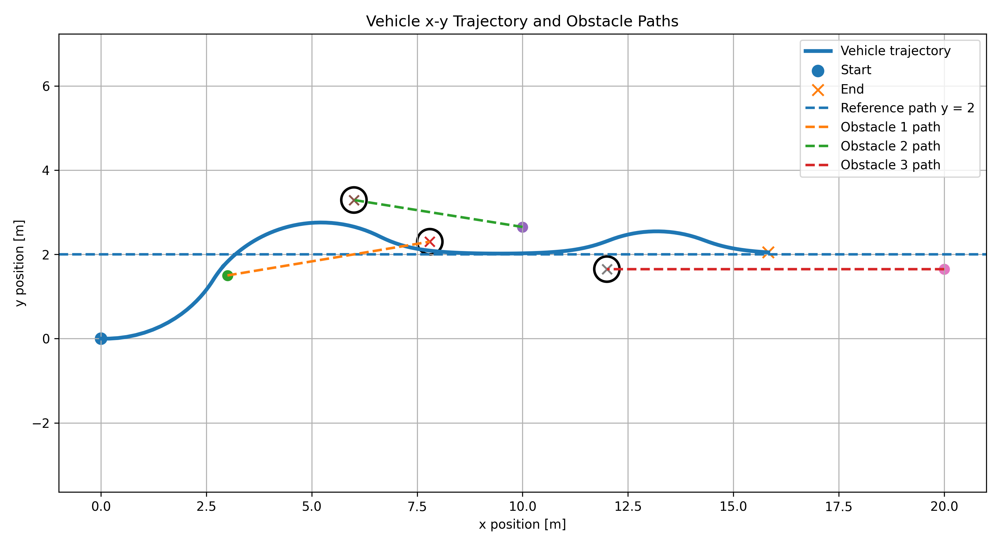
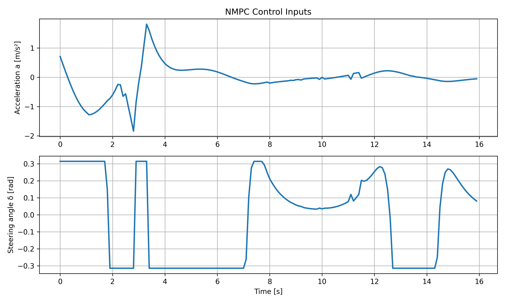
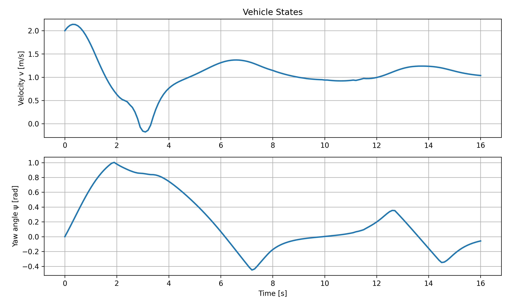

# Autonomous Vehicle NMPC Simulation with MuJoCo Visualization

This project implements a nonlinear model predictive control (NMPC) framework for an autonomous vehicle using a kinematic bicycle model. The vehicle tracks a reference path while avoiding dynamic obstacles, and the resulting motion is visualized in MuJoCo using a car-like 3D model with steering wheels, moving obstacles, safety regions, and LiDAR-style sensing beams.

The main goal of this project is to demonstrate trajectory planning, control, obstacle avoidance, and simulation visualization for autonomous driving applications.

---

## Project Overview

The vehicle is modeled using a kinematic bicycle model with the state vector:

```math
x = [p_x, p_y, \psi, v]
```

where:

* `p_x` is the longitudinal position
* `p_y` is the lateral position
* `ψ` is the yaw angle
* `v` is the vehicle velocity

The control input is:

```math
u = [a, \delta]
```

where:

* `a` is acceleration
* `δ` is the steering angle

At each simulation step, the NMPC controller solves an optimization problem to compute the best acceleration and steering command. The controller attempts to follow a reference path while satisfying dynamic constraints, control limits, and obstacle-avoidance constraints.

MuJoCo is used as a 3D visualization and replay environment. The vehicle motion is computed by the NMPC and bicycle model, while MuJoCo displays the resulting trajectory using a more realistic car-like visual model.

---

## Key Features

* Nonlinear model predictive control using CasADi
* Kinematic bicycle vehicle model
* Dynamic obstacle prediction
* Obstacle avoidance with soft safety constraints
* Acceleration and steering input limits
* MuJoCo 3D visualization

* Plots for:

  * control inputs
  * vehicle velocity and yaw angle
  * x-y vehicle trajectory
  * obstacle trajectories

---

## Simulation Description

The vehicle starts from an initial state and attempts to track a reference lane while avoiding moving obstacles. The obstacles are modeled with constant-velocity dynamics:

```math
p_{obs}(k+1) = p_{obs}(k) + v_{obs}\Delta t
```

The NMPC predicts both the vehicle motion and obstacle motion over a finite prediction horizon. Obstacle avoidance is enforced using a circular safety constraint:

```math
(p_x - o_x)^2 + (p_y - o_y)^2 \geq r_{safe}^2
```

where `r_safe` includes the obstacle radius, vehicle radius approximation, and optional safety margin.

---


---

## Installation

Clone the repository:

```bash
git clone https://github.com/YOUR_USERNAME/Autonomous-Vehicle-NMPC-MuJoCo.git
cd Autonomous-Vehicle-NMPC-MuJoCo
```

Install the required Python packages:

```bash
pip install -r requirements.txt
```

Required packages:

```txt
numpy
casadi
mujoco
imageio
imageio-ffmpeg
matplotlib
```


### Control Inputs

The control plot shows the acceleration and steering angle selected by the NMPC controller over time.

```text
Acceleration: a(t)
Steering angle: δ(t)
```

### Vehicle States

The state plot shows the vehicle velocity and yaw angle over time.

```text
Velocity: v(t)
Yaw angle: ψ(t)
```

### X-Y Trajectory

The trajectory plot shows:

* the vehicle path,
* the reference path,
* obstacle paths,
* obstacle radius circles,
* start and end positions.

---

## Example Results

### Vehicle Trajectory



### Control Inputs



### Vehicle States



### MuJoCo Simulation Video

[Watch the simulation video](results/demo_video.mp4)

---

## Technical Details

### Kinematic Bicycle Model

The vehicle dynamics are:

```math
p_x(k+1) = p_x(k) + \Delta t \, v(k)\cos(\psi(k))
```

```math
p_y(k+1) = p_y(k) + \Delta t \, v(k)\sin(\psi(k))
```

```math
\psi(k+1) = \psi(k) + \Delta t \frac{v(k)}{L}\tan(\delta(k))
```

```math
v(k+1) = v(k) + \Delta t \, a(k)
```

where `L` is the wheelbase.

### NMPC Objective

The controller minimizes a cost function that penalizes:

* deviation from the reference trajectory,
* yaw error,
* velocity error,
* acceleration effort,
* steering effort,
* obstacle-avoidance slack variables.

The optimization problem is solved using CasADi and IPOPT.

---

## Current Limitations

This project uses MuJoCo primarily as a visualization and replay environment. The vehicle does not yet use full MuJoCo physical vehicle dynamics.

Current simplifications include:

* no tire-force model,
* no suspension model,
* no actuator dynamics,
* no wheel-ground traction modeling,
* LiDAR beams are visual only,
* obstacle prediction assumes constant velocity.

These simplifications are intentional because the focus of this project is NMPC trajectory planning and obstacle avoidance using a kinematic bicycle model.


